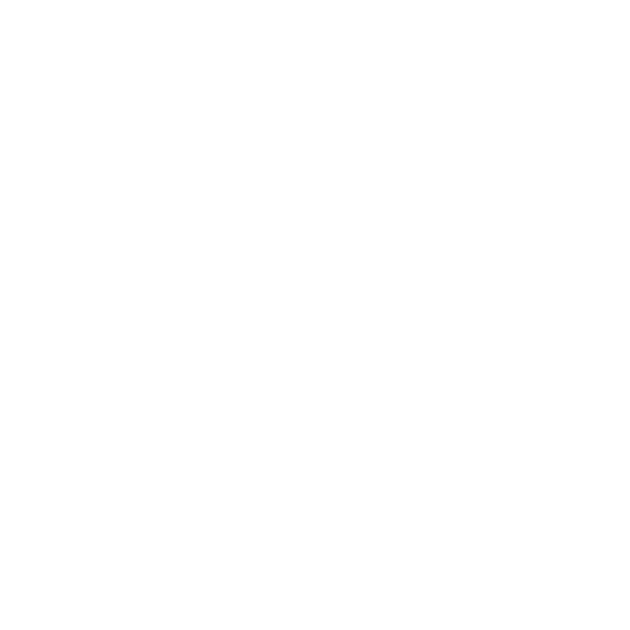

## Haarlem Bij Nacht...

...is a collaboration between Marike Benschop and Joshua Baumgarten, featuring photos taken at night during the Corona curfew in Haarlem, Holland. 

The site features a slow-fade welcome page, and then a page which features a triple randomiser triggered by pressing on a flower icon. The icon itself, a text bank on the left and the image section on the right all change on a random basis. 

The site was built to create a moody, sensitive atmosphere where the photographs and text selections can have the intended effect.

All photographs used on the site are taken by Marike Benschop. A logo was commissioned but used only as a favicon on the browser tab. 

A contact section features both a Dutch and English version of the project manifest. There is also a link to the publisher selling the official art-book. The book features more photos than are shown in the site, as well as full length versions of the poem snippets shown here. 

